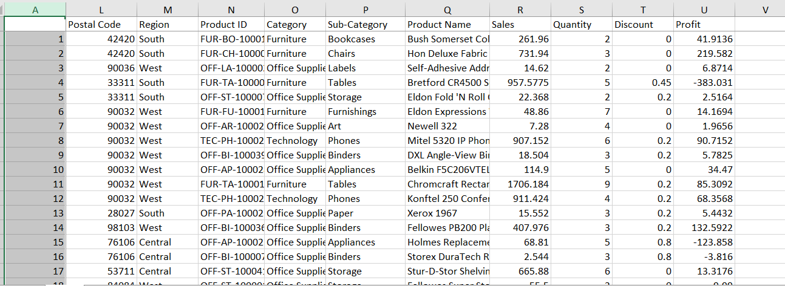
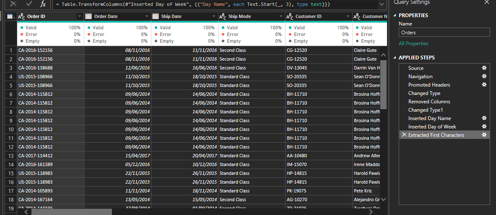

# Superstore Data Analysis with Power BI
# Originial data
The original datset had a total of 21 rows and 9995 columns


# Transformed data and steps used to transform the data in power query



This project showcases an analysis of Superstore sales and transactions data, created as part of the **"Data Visualization Essentials with Power BI"** course. The goal was to apply learned concepts to clean and visualize data effectively.

## Features
The report is structured across multiple pages and includes advanced interactive elements:

1. **Periodic Report**:
   - Sales and transaction trends over time.
   - Insights into customer segments and their behavior.
# periodic report page


2. **Locations Report**:
   - Drill-through functionality enabled for detailed regional analysis.
   # locations report page
   

   # locations report drill trough page
   
   


3. **Advanced Analysis**:
   - **Key Performance Indicator (KPI)** visuals to track critical metrics.
   - **Decomposition Tree** for detailed breakdown and analysis.

   # Advanced Analysis Report page

4. **Segment Tooltip**:
   - Enabled for detailed insights into specific customer segments shares when interacting with visuals.
   # segement tooltip page
   

---

## Tools Used
- **Data Cleaning**: Power Query
- **Visualization**: Power BI

---

## Data Source
The dataset was provided as part of the online course **"Data Visualization Essentials with Power BI"**, designed to help learners demonstrate their skills by building a comprehensive report.

---

## Key Visualizations
- **Line Charts**: Display trends over months.
- **Bar Charts**: Show sales and transaction patterns by day of the week.
- **Decomposition Tree**: Drill-down analysis of specific metrics.
- **KPI Visuals**: Summarize key statistics like total sales and transactions.
- **Map**        : To show distribution of sales by city
- ** matrix table:  To show  state and ship mode

---

## How to Use
1. Open the report in Power BI to explore interactive features.
2. Use filters for:
   - **Year**
   - **Region**
   - **Category**
3. Drill through the **Locations Report** for regional insights.
4. Hover over visuals to explore **Segment Tooltips**.

---

## Conclusion
This project demonstrates the practical application of Power BI for analyzing sales and transaction data, incorporating advanced visuals, and enabling interactivity. It reflects the skills gained during the course and offers a structured approach to data analysis.

---
```

